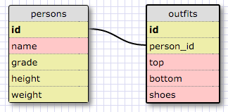

Release 5: SELECTing data from a database

1. Select all data for all states
  -SELECT * FROM states;

2. Select all data for all regions
  -SELECT * FROM regions;

3. Select the state_name and population for all states.
  -SELECT state_name, population FROM states;

4. Select the state_name and population for all states ordered by population. The state with the highest population should be at the top.
  -SELECT state_name, population FROM states ORDER BY population DESC;

5. Select the state_name for the states in region 7.
  -SELECT state_name FROM states WHERE region_id = 7;

6. Select the state_name and population_density for states with a population density over 50 ordered from least to most dense.
  -SELECT state_name, population_density FROM states WHERE population_density > 50 ORDER BY population_density ASC;

7. Select the state_name for states with a population between 1 million and 1.5 million people.
  -SELECT state_name FROM states WHERE population > 1000000 AND population < 1500000;

8. Select the state_name and region_id for states ordered by region in ascending order.
  -SELECT state_name, region_id FROM states ORDER BY region_id ASC;

9. Select the region_name for the regions with "Central" in the name.
  -SELECT region_name FROM regions WHERE region_name LIKE '%Central%';

10. Select the region_name and the state_name for all states and regions in ascending order by region_id. Refer to the region by name. (This will involve joining the tables).
  -SELECT region_name, state_name FROM regions INNER JOIN states ON regions.id=states.region_id;

Release 6: Schema

Release 7: Reflect
1. What are databases for?
  -Databases are used to store and access large amounts of data in an organized way. For example, in Ruby it would be unrealistic (and just a huge headache) to store long lists and/or tables in arrays or hashes. Not to mention the difficulty in accessing pieces of information that matched certain criteria. Databases, on the other hand, let you easily select data entries from the entire table that satisfy any number of criteria.
1. What is a one-to-many relationship?
  -A one-to-many relationship connects two fundamentally different things where the 'one' items belong to a 'many' item. For example, movies and their genres have a one-to-many relationship. Each movies belongs to *one* genre, and each genre has *MANY* movies in it.
1. What is a primary key? What is a foreign key? How can you determine which is which?
  -Databases use primary keys to prevent tables from having duplicate rows. A primary key is the particular identifier (such as SSN, student ID, etc.) that is unique for each record in a table.
  -A foreign key points a table to a row in another table. So for this challenge the states table had a field 'region_id', which was a foreign key pointing to the 'id' primary key of the regions table.
  -You can determine primary keys from foreign keys because the primary key of a table cannot be repeated, but foreign keys can be. In this challenge there were 11 regions. In the regions table the primary key was 'id', and each region had a unique 'id' from 1 to 11. In the states table 'region_id' was a foreign key pointing to 'id' from regions, but several different states had each 'region_id' because each region was made up of several states. This is also just intuitive when you think about it.
1. How can you select information out of a SQL database? What are some general guidelines for that?
  -The keywords 'SELECT' and 'SELECT DISTINCT' can select information out of a SQL database.
  -The standard format is 'SELECT *column_name* FROM *table_name*'
  -Instead of selecting an entire column you can use other keywords to narrow down your search. A few common ones that we used are: WHERE, ORDER BY, and LIKE.