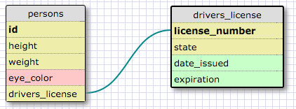
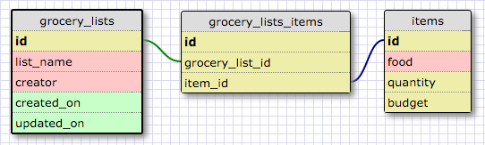

Release 2: Create a One-to-one Schema

Release 3/4: Many to Many Relationships

Release 6: Reflect

1. What is a one-to-one database?
  * A one-to-one database is when two things have a single relationship to each other. Each entry from table 1 will only be used once (or not at all) in table 2, and each entry in table 2 will only be used once in table 1. The example above was people and driver's licenses. No person can have more than one driver's license, and no driver's license can belong to more than one person. However, a person could not have a driver's license at all.

2. When would you use a one-to-one database? (Think generally, not in terms of the example you created).
  * The general rule of thumb is to use a one-to-one relationship if you have a relationship where a group of fields can all optionally be empty. You may also want to use a one-to-one database if you want to split a table's properties into two chunks, say frequently used vs. not as frequently used. So an example would be a library database that stores information on each book. Properties like 'title' and 'author' are frequently queried, but a property like 'publisher' is not. You could store 'publisher' and other less important properties in a second table that has a one-to-one relationship with your main table.

3. What is a many-to-many database?
  * A many-to-many database is when the rows in the first table can map to multiple rows in the second table, and those rows in the second table can also map to multiple (different) rows in the first table.
  * A join table connects the two independent tables by keeping track of both ids.

4. When would you use a many-to-many database? (Think generally, not in terms of the example you created).
  * Whenever you have two independent tables with a lot of overlap/intersect. This model is fairly common and can be illustrated with any item that involes collaboration of more than one party. Ex. legislative bills...they usually have several authors, and each of those authors works on several different bills throughout his/her career.

5. What is confusing about database schemas? What makes sense?
  * I'm a little confused about one-to-one relationships and whether each table should still have a vague 'id' or if there should be primary key/foreign key overlap like in my schema above.